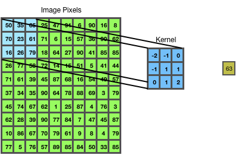

Convolution is a process in which each pixel is multiplied by the corresponding value of a Kernal (matrix of values) and the result is added together. This can easily be understood when images are taken into consideration.

Shown below in the diagram is a representation of image with its pixel values. It is accompanied by a Kernel with its own values. After the convolution is carried out, the resultant value is show in the right hand corner

The convoluted output can be calculated as follows :

**Convolution o/p =** **Image Pixels::A1×Kernel::A1 + Image Pixels::B1×Kernel::B1 + Image Pixels::C1×Kernel::C1 + Image Pixels::A2×Kernel::A2 + Image Pixels::B2×Kernel::B2 + Image Pixels::C2×Kernel::C2+Image Pixels::A3×Kernel::A3 + Image Pixels::B3×Kernel::B3 + Image Pixels::C3×Kernel::C3**

In the above example the Kernel size is 3x3 and the Image size is 10x10

During the convolution process, the image kernel is slided across the image as per the defined number of slides. 

**<u>Kernels:</u>** In the above example as part of the convolution an image kernel is defined. The image kernel is nothing but a set of number which are multiplied with the corresponding pixel values of the image. Almost as part of the convention the kernels are square kernels i.e. of the size nxn. In the above example the size is 3x3. Although image kernels can be defined with higher sizes such as 5x5,7x7 etc..always 3x3 kernel sizes are preferred. This is due to the fact these are efficient during computation and the scientific libraries contained optimized implementations.So what does the image kernel do? The image kernel helps in identifying certain features of the given image. So during this process it helps discover the presence of certain features. But for us to extract these feature the kernels need to be pre-defined with certain values. Some examples of image kernels are blur,bottom sobel,emboss,identity,outline,sharpen etc..(shown below)
$$
Sharpen\,Kernel \ \ \ Emboss\,Kernel \ \ \ Outline\,Kernel\\
\left( \begin{matrix}
  \mathbb 0  & \mathbb -1  & \mathbb 0 \\
  \mathbb -1  & \mathbb 5  & \mathbb -1 \\
  \mathbb 0  & \mathbb -1  & \mathbb 0
  \end{matrix}
  \right)
\
  \left( 
  \begin{matrix}
  \mathbb -2  & \mathbb -1  & \mathbb 0 \\
  \mathbb -1  & \mathbb 1  & \mathbb 1 \\
  \mathbb 0  & \mathbb -1  & \mathbb 2 
  \end{matrix}
   \right)
  \
  \left( 
  \begin{matrix}
  \mathbb -1  & \mathbb -1  & \mathbb -1 \\
  \mathbb -1  & \mathbb 8  & \mathbb -1 \\
  \mathbb -1  & \mathbb -1  & \mathbb -1 
  \end{matrix}
   \right)
$$
In CNN, these filters are not predefined, instead these are learned as part of the training process.In CNN for each layer, in addition the legth and width of the kernel, we also define the number of kernels/filter . This will result in an output where the number of channels will be same as that of the number kernels/filter defined for convolution.

Ex:- 5x5,3 channels is convolved with 3x3,3 channels of **<u>32 filters</u>** result in 3x3,**<u>32 channels</u>** output.

<u>**Channels**</u>:-During a convolution operation the result that is obtained when an input image is convolved with a kernel/filter is store in feature map.It has to be noted that a single feature map contains the result of the convolutions for all pixels of the input image.Also each filter generates its corresponding feature maps after convolution. This is illustrated in the below example:

Input : 5x5, 3 channels

Kernel: 3x3, 3 channels 32 filters

Output: 3x3, 32 channels

Here the number of feature maps in the output is 32

Now consider a pre-trained CNN which was trained on ImageNet data, if were to visualize the feature maps in each of the layers, it appears that the layers near to the input seem to have learnt the basic features i.e. lines, curves etc..and as we proceed farther from input the layers seem to learn more complex shapes and textures. This intitution can come in handy if were to use a pre-trained network as a starting point.

**<u>3x3 convolution</u>**:- A 3x3 convolution can be defined as a convolution in which a kernel/filter of size 3x3 is used.So why do we need to use 3x3 kernels for convolution? Can we not use higher kernel sizes for convolution? Indeed if we closely observe we can also use higher kernel sizes during convolutions. However this is not recommended due to the fact that 3x3 convolutions are computationally efficient. Also higher kernel size convolution effects can be derived by using more than single 3x3 convolutions. Lets see an example on this.

Consider the following :

Example1:-

Input : 5x5, 3 channels

Kernel: 5x5, 3 channels 1 filter

Output: 1x1, 1 channel

Example2:-

Input : 5x5, 3 channels

Kernel1: 3x3, 3 channels 1 filter

Output1: 3x3, 1 channel

Kernel2: 3x3, 1 channel 1 filter

Output: 1x1, 1 channel

If you observer example1 and example2, we are able to achieve the same effect of convolving a 5x5 image with 5x5 kernel using two 3x3 convolutions

Following are some of the observations using two 3x3 convolutions Vs one 5x5 convolution on a 5x5 image

- Number of weights when two 3x3 convolutions were used is 18 Vs Number of weights when one 5x5 convolution was used is 25
- Number of layers for 3x3 convolutions is more than 5x5 convolutions , hence more GPU RAM may be needed 
- A 3x3 convolution might help learn detail,complex features and thus help identify features related to small images, however this may not be possible with 5x5 convolution

**<u>Calculating number of 3x3 convolution operations needed to reach 1x1 from 199x199</u>**:-

199x199 => 197x197 => 195x195 => 193x193 => 191x191 => 189x189 => 187x187 => 185x185 => 183x183 

=> 181x181 => 179x179 => 177x177 => 175x175 => 173x173 => 171x171 => 169x169 => 167x167

=> 165x165 => 163x163 => 161x161 => 159x159 => 157x157 => 155x155 => 153x153 => 151x151

=> 149x149 => 147x147 => 145x145 => 143x143 => 141x141 => 139x139 => 137x137 => 135x135

=> 133x133 => 131x131 => 129x129 => 127x127 => 125x125 => 123x123 => 121x121 => 119x119

=> 117x117 => 115x115 => 113x113 => 111x111 => 109x109 => 107x107 => 105x105 => 103x103

=> 101x101 => 99x99 => 97x97 => 95x95 => 93x93 => 91x91 => 89x89 => 87x87 => 85x85

=> 83x83 => 81x81 => 79x79 => 77x77 => 75x75 => 73x73 => 71x71 => 69x69 => 67x67

=> 65x65 => 63x63 => 61x61 => 59x59 => 57x57 => 55x55 => 53x53 => 51x51 => 49x49

=> 47x47 => 45x45 => 43x43 => 41x41 => 39x39 => 37x37 => 35x35 => 33x33 => 31x31

=> 29x29 => 27x27 => 25x25 => 23x23 => 21x21 => 19x19 => 17x17 => 15x15 => 13x13

=> 11x11 => 9x9 => 7x7 => 5x5 => 3x3 => 1x1

So as per the above steps, the total number of 3x3 convolution operations needed for 199x199 to reach 1x1

is 99