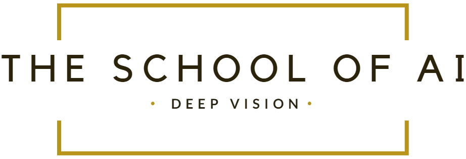

# 

### 					                    									Extensive Vision AI Program

##### Assignment 13

- Refer to [Assignment 12](https://github.com/ksasi/EVA/blob/master/Project12/Assignment12.ipynb) code.

- Replace whatever model you have there with the ResNet18 model as shown below.

- Your model must look like Conv->B1->B2->B3->B4 and not individually called Convs. 

- If not already using, then:

  1. Use Batch Size 128
  2. Use Normalization values of: (0.4914, 0.4822, 0.4465), (0.2023, 0.1994, 0.2010)
  3. Random Crop of 32 with padding of 4px
  4. Horizontal Flip (0.5)
  5. Optimizer: SGD, Weight-Decay: 5e-4
  6. OneCycleLR
  7. Save model (to drive) after every 50 epochs or best model till now

- Describe your blocks, and the stride strategy you have picked

- Train for 300 Epochs

- Assignment Target Accuracy is 90%, so exit gracefully if you reach 90% (you can target more, it can go till ~93%)

