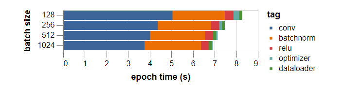

# 

### 					                    									Extensive Vision AI Program

##### ASSIGNMENT 14

## 

 

Refer this manual: [https://myrtle.ai/learn/how-to-train-your-resnet/ (Links to an external site.)](https://myrtle.ai/learn/how-to-train-your-resnet/)

- some of the image preprocessing (padding, normalisation and transposition) is needed on every pass through the training set and yet this work is being repeated each time. Other preprocessing steps (random cropping and flipping) differ between epochs and it makes sense to delay applying these. Although the preprocessing overhead is being mitigated by using multiple CPU processes to do the work, it turns out that PyTorch dataloaders (as of version 0.4) launch fresh processes for each iteration through the dataset. The setup time for this is non-trivial, especially on a small dataset like CIFAR10. By doing the common work once before training, removing pressure from the preprocessing jobs, we can reduce the number of processes needed to keep up with the GPU down to one. In heavier tasks, requiring more preprocessing or feeding more than one GPU, an alternative solution could be to keep dataloader processes alive between epochs. In any case, the effect of removing the repeat work and reducing the number of dataloader processes is a further 15s saving in training time (almost half a second per epoch!) and a new training time of 308s.
- Moving from 128 to 512 batch size, takes time to 256s (learning rate is increased by 10%)
- 
- clear guidance is shared on how to reduce the batchnorm time on pytorch, keras, might not be too easy
- with above, time drops to 154s
- OneCycle is changed with slanted onecycle
- Then it removes the ROR concept, and it gets better!
- 3x3 with strides is repl
- aced by normal 3x3 and maxpooling
- Network achieves 93.8% in 66s and 94% in 79s! (single GPU by the way!)

 

Some Notes:

- [https://github.com/davidcpage/cifar10-fast/blob/d31ad8d393dd75147b65f261dbf78670a97e48a8/experiments.ipynb (Links to an external site.)](https://github.com/davidcpage/cifar10-fast/blob/d31ad8d393dd75147b65f261dbf78670a97e48a8/experiments.ipynb)
- You have $300:
  - set up Tensorflow-keras and GPU on [Google Cloud Platform  (Links to an external site.)](https://medium.com/@karan817/setting-up-tensorflow-and-gpus-on-google-cloud-platform-to-run-your-neural-network-implementations-df6b81d00f31)
    - or [this (setting up jypyter on GCP) (Links to an external site.)](https://towardsdatascience.com/running-jupyter-notebook-in-google-cloud-platform-in-15-min-61e16da34d52)
  - DO NOT FORGET TO SENT REQUEST TO ADD GPU
  - CUDA [INSTALLATION (Links to an external site.)](https://gist.github.com/Mahedi-61/2a2f1579d4271717d421065168ce6a73) ON GCP
  - DO NOT FORGET TO DOWNLOAD CUDNN AND THEN UPLOAD IT TO GCP (figure out a faster way than using upload option)
- Colab 93%, 24 Epochs, 858 seconds [LINK (Links to an external site.)](https://colab.research.google.com/drive/16T4C-t148ZRpLz2MiNBZ0eYyGPLNN2Sx)
- GCP - 93.06% 24 Epochs, 462 second [LINK (Links to an external site.)](https://drive.google.com/drive/folders/1mQ0jcDOU9uzdT8veoX11SbioBwbnkaXA?usp=sharing)
  

 

## 8000 Points

1. They code NEEDs to on GCP or any other cloud (other than Colab). 
2. Any machine with V100 will also work 
3. You NEED to hit 94% accuracy, target is 100 seconds
4. if you have not done 12, 13, you can submit this assignment for those. 

 
