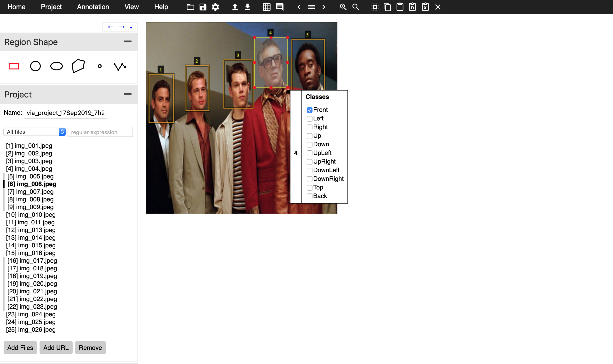
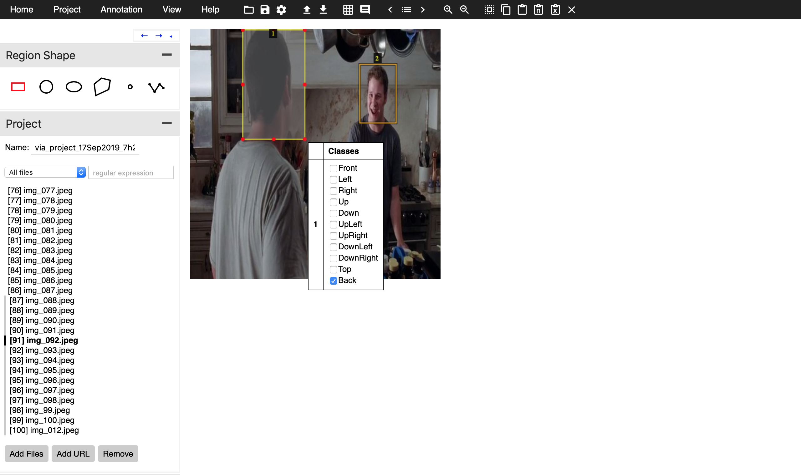

# 

### 					                    									Extensive Vision AI Program

##### ASSIGNMENT 19

- Collect 100 images of faces from online sources (you can use any existing database as well, but we need multiple faces)
- Please make sure that there are not too many faces in the image
- Classes are:  Front, Left, Right, Up, Down, UpLeft, UpRight, DownLeft, DownRight, Top, Back. Please make sure you have these kind of faces in your collection. Also please make sure that your LEFT is the LEFT of your screen. 
- resize your images to 400x400
- Rename your images as img_001 to img_100. 
- Annotate these objects using [VGG Annotator](http://www.robots.ox.ac.uk/~vgg/software/via/) (using a local copy)
- Use K-means clustering to find out the top 4 anchor boxes
- Upload to github
  - images in a zipped folder
  - your annotation file (json)
  - k-means code
- Add a readme file and show:
  - few screenshots of your annotations
  - your 4 bounding box dimensions

##### RESULTS

- Annotation screen shots

  

  

- The 4 bounding box dimensions ([width, height]) are shown below:

  - [ 54.568 , 83.512 ]
  - [106.796875 , 174.09375 ]
  - [ 74.10869565, 124.11594203]
  - [124.83333333, 263.83333333]

  

  ##### 