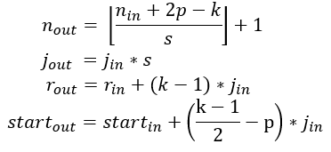

# 

### 					                    									Extensive Vision AI Program

##### Assignment 7A

- Check this paper : [https://arxiv.org/pdf/1409.4842.pdf](https://arxiv.org/pdf/1409.4842.pdf)

  - Receptive Field is specified as 224x224 on page 6

  - Derive the receptive field using the below formulae

    #### **Receptive Field Calculations**

     

    

    **j** is the jump, **r** is the receptive field (ignore start for now)

**Assignment 7B**

- Design the below network (CIFAR10) and train for 100 epochs(Add BN and ReLU after every layer)

  ​	
  
  