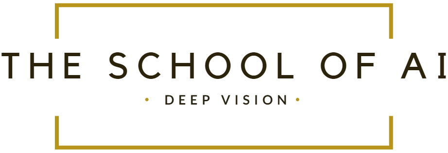
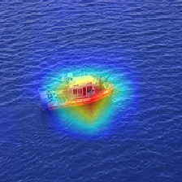

# 

### 					                    									Extensive Vision AI Program

##### Assignment 9 - Part1

- Obtain Assignment 6A code along with optimised model/network and integrate gradCAM with the code. Learn more about [gradCAM here.](http://www.hackevolve.com/where-cnn-is-looking-grad-cam/)

- Test 4 images from the network and show the visualization as below:

  

**Assignment 9 - Part2**

- Train Assignment 6A optimised model/network again, with CutOut. Use [this link](https://github.com/yu4u/cutout-random-erasing) for reference.
- Show the same 4 images again with gradCAM's result.

