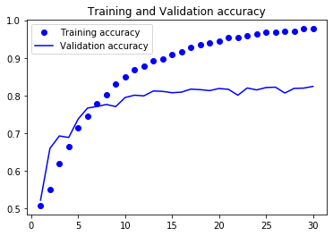
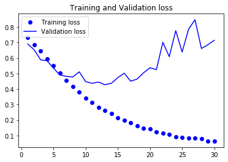

# 


### 					                    									Extensive Vision AI Program

Assignment:

1. Refer to the code mentioned on pages: 182-195 of this [BOOK](http://faculty.neu.edu.cn/yury/AAI/Textbook/Deep Learning with Python.pdf)

2. Repeat the same code while adding code comments. 

3. Train the GLOVE based model with 8000 samples instead of 200. 

4. Submit on GitHub and share the link. 

5. Mention your results along with your training and validation charts on the ReadMe page. Assignment without readme will be evaluated as not submitted with -30% score

6. Fixed assignment deadline

Result:

Achieved highest validation accuracy of 82.42%, when trained for 30 epochs , making embedding layer as trainable

```
Train on 8000 samples, validate on 10000 samples
Epoch 1/30
8000/8000 [==============================] - 3s 377us/sample - loss: 0.7319 - acc: 0.5079 - val_loss: 0.6907 - val_acc: 0.5221
Epoch 2/30
8000/8000 [==============================] - 3s 321us/sample - loss: 0.6837 - acc: 0.5514 - val_loss: 0.6526 - val_acc: 0.6596
Epoch 3/30
8000/8000 [==============================] - 3s 323us/sample - loss: 0.6457 - acc: 0.6186 - val_loss: 0.5883 - val_acc: 0.6926
Epoch 4/30
8000/8000 [==============================] - 3s 318us/sample - loss: 0.5960 - acc: 0.6637 - val_loss: 0.5825 - val_acc: 0.6886
Epoch 5/30
8000/8000 [==============================] - 2s 309us/sample - loss: 0.5515 - acc: 0.7132 - val_loss: 0.5342 - val_acc: 0.7374
Epoch 6/30
8000/8000 [==============================] - 3s 313us/sample - loss: 0.5046 - acc: 0.7455 - val_loss: 0.4905 - val_acc: 0.7666
Epoch 7/30
8000/8000 [==============================] - 3s 316us/sample - loss: 0.4565 - acc: 0.7794 - val_loss: 0.4819 - val_acc: 0.7708
Epoch 8/30
8000/8000 [==============================] - 3s 329us/sample - loss: 0.4145 - acc: 0.8029 - val_loss: 0.4774 - val_acc: 0.7762
Epoch 9/30
8000/8000 [==============================] - 3s 320us/sample - loss: 0.3807 - acc: 0.8304 - val_loss: 0.5109 - val_acc: 0.7705
Epoch 10/30
8000/8000 [==============================] - 3s 316us/sample - loss: 0.3418 - acc: 0.8501 - val_loss: 0.4479 - val_acc: 0.7946
Epoch 11/30
8000/8000 [==============================] - 2s 308us/sample - loss: 0.3131 - acc: 0.8680 - val_loss: 0.4368 - val_acc: 0.8008
Epoch 12/30
8000/8000 [==============================] - 2s 309us/sample - loss: 0.2834 - acc: 0.8783 - val_loss: 0.4451 - val_acc: 0.7990
Epoch 13/30
8000/8000 [==============================] - 3s 316us/sample - loss: 0.2630 - acc: 0.8923 - val_loss: 0.4278 - val_acc: 0.8120
Epoch 14/30
8000/8000 [==============================] - 3s 314us/sample - loss: 0.2411 - acc: 0.8975 - val_loss: 0.4370 - val_acc: 0.8109
Epoch 15/30
8000/8000 [==============================] - 3s 318us/sample - loss: 0.2138 - acc: 0.9078 - val_loss: 0.4731 - val_acc: 0.8073
Epoch 16/30
8000/8000 [==============================] - 3s 318us/sample - loss: 0.1967 - acc: 0.9165 - val_loss: 0.5020 - val_acc: 0.8089
Epoch 17/30
8000/8000 [==============================] - 3s 325us/sample - loss: 0.1841 - acc: 0.9283 - val_loss: 0.4504 - val_acc: 0.8169
Epoch 18/30
8000/8000 [==============================] - 3s 326us/sample - loss: 0.1644 - acc: 0.9356 - val_loss: 0.4642 - val_acc: 0.8155
Epoch 19/30
8000/8000 [==============================] - 3s 326us/sample - loss: 0.1456 - acc: 0.9399 - val_loss: 0.5045 - val_acc: 0.8130
Epoch 20/30
8000/8000 [==============================] - 3s 319us/sample - loss: 0.1420 - acc: 0.9451 - val_loss: 0.5365 - val_acc: 0.8186
Epoch 21/30
8000/8000 [==============================] - 2s 312us/sample - loss: 0.1248 - acc: 0.9542 - val_loss: 0.5252 - val_acc: 0.8164
Epoch 22/30
8000/8000 [==============================] - 3s 318us/sample - loss: 0.1141 - acc: 0.9544 - val_loss: 0.7008 - val_acc: 0.8007
Epoch 23/30
8000/8000 [==============================] - 3s 313us/sample - loss: 0.1079 - acc: 0.9578 - val_loss: 0.6087 - val_acc: 0.8200
Epoch 24/30
8000/8000 [==============================] - 2s 311us/sample - loss: 0.0925 - acc: 0.9644 - val_loss: 0.7760 - val_acc: 0.8148
Epoch 25/30
8000/8000 [==============================] - 3s 317us/sample - loss: 0.0876 - acc: 0.9674 - val_loss: 0.6385 - val_acc: 0.8211
Epoch 26/30
8000/8000 [==============================] - 2s 312us/sample - loss: 0.0823 - acc: 0.9684 - val_loss: 0.7856 - val_acc: 0.8221
Epoch 27/30
8000/8000 [==============================] - 3s 320us/sample - loss: 0.0822 - acc: 0.9716 - val_loss: 0.8463 - val_acc: 0.8066
Epoch 28/30
8000/8000 [==============================] - 3s 318us/sample - loss: 0.0813 - acc: 0.9707 - val_loss: 0.6609 - val_acc: 0.8189
Epoch 29/30
8000/8000 [==============================] - 2s 306us/sample - loss: 0.0660 - acc: 0.9770 - val_loss: 0.6858 - val_acc: 0.8196
Epoch 30/30
8000/8000 [==============================] - 3s 313us/sample - loss: 0.0644 - acc: 0.9765 - val_loss: 0.7139 - val_acc: 0.8242
```

Plots:



