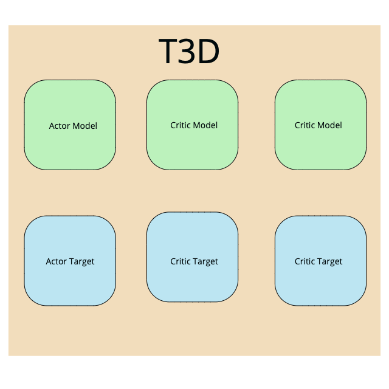

# 

### 					                    									Extensive Vision AI Program

Assignment:

1. Well, there is a reason why this code is in the image, and not pasted. 
2. You need to:
   1. write this code down on a Colab file, upload it to GitHub. 
   2. write a Readme file explaining all the 15 steps we have taken:
      1. read me must explain each part of the code
      2. each part of the code must be accompanied with a drawing/image (you cannot use the images from the course content)
   3. Upload the link.

Please note that you MUST understand this code properly. In the next session, you will get the complete code. We will implement it on AntBulletEnv, and others, where the environment is easy. 

Result:

# T3D Code Explanation

- STEP1 : This step consists of creating a ReplayBuffer class. This class defines a storage array and max size for that array. Along with this this class also consists of methods to store transitions  and also sample these transitions. This constructs or populates the Experience Replay memory. This is initialized with a size of 1e6 and then populated with new transitions.
- STEP2 : In this step an Actor class is defined, this helps define an Actor model and Actor Target. The model created here is a fully connected DNN.
- STEP3 : The class in this step is defined to return two Critic models . This can also be used for two Critic Targets. 
- STEP4 : T3D class is created and appropriate variables are initialized. In the train method in step4, a batch of transitions i.e. (state, next state, action, reward) are sampled by calling an instance of ReplayBuffer class.
- STEP5 : The Actor Target plays the next action from the next state
- STEP6 : Gaussian noise is added to the next action obtained in the previous step and then the range is limited as per the values supported by the environment
- STEP7 : The two Critic targets take both next state and next action as inputs and return two Q values
- STEP8 : From both the Q values obtained in the prevous step, min Q value is selected
- STEP9 : In this step, target Q is obtained, however this using this doesn't help as this needs to be calculated after the episode is completed. Hence this is verified by checking done variable. Since its own graph is created at this step, detach is called to resolve this.
- STEP10 : Both the critics return Q values by using state and action values
- STEP11 : Critic loss is computed for both the critics by checking the target Q and current Q values
- STEP12 : The critic models are updated by back propagating the combined critic loss
- STEP13 : In this step , for every two iterations ( this is calculated using it % policy_freq) , the Actor model is updated by using gradient ASCENT 
- STEP14: For every two iterations, Actor Target is updated using Polyak Averaging. tau variable is used for the polyak averaging.
- STEP15: Similarly as done in the previous step Critic Target is also updated uisng Polyak Averaging for every two iterations.

